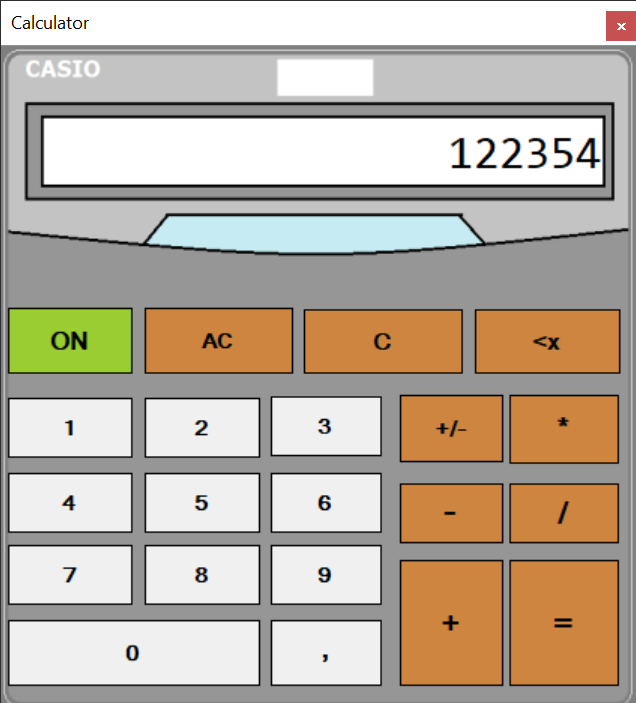
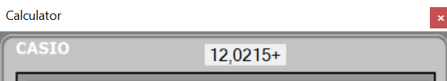
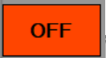
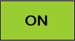
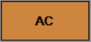
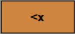
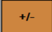

# FullFanctionCalculator
A full function calculator created by C#. 

# Label and Its function

 
It shows that the number on the screen will be treated with wich number for next operation.
 

# Buttons And Their Functions

 
The device powers off and the buttons are not usable when the user presses it. 

 
The device powers on and the buttons are usable again when the user presses it.

 
It clears the screen and the label. It restarts the program.

 
It just clears the screen for a second entrance.

 
It just clears the screen one by one in every press.

 
When user presses it, it makes the number negative or positive.
